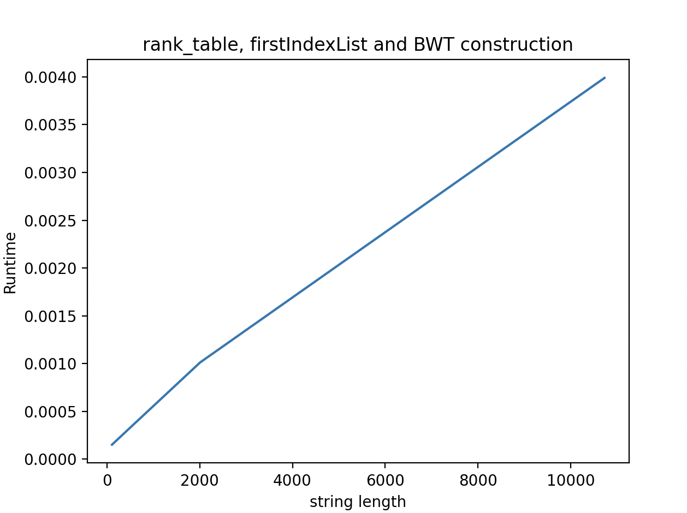
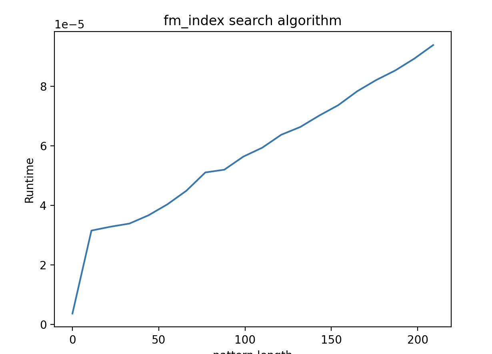

# Project 4: BWT-based matching (FM-index)

Now that you have a functioning suffix array, you should implement the BWT-based search, also known as FM-index. This algorithm improves the search in the suffix array from O(m log n + z) to O(m + z) after O(n) preprocessing (plus whatever time it takes you to build your suffix array).

You should implement a suffix array construction algorithm. You can choose to implement the naive algorithm where you explicitly sort strings, or the O(n) skew or SAIS algorithms, or any other algorithm. After constructing the suffix array, you should implement the binary search based and the Burrows-Wheeler based search algorithm.

The algorithms should be implemented in a program named `fm`. Since we are building data structures in a preprocessing step, and since a common usage of read mappers is to map multiple files of reads against the same genome, we should build the tool such that we can preprocess a genome once, and then reuse the preprocessed data on subsequent searches.

Therefore, your tool should have options for either preprocessing or read-mapping. If you run it as `fm -p genome.fa` it should preprocess the sequences in `genome.fa`, and if you run the tool as  `fm genome.fa reads.fq` it should search the genome and produce output in the same format as the previous projects.

When you preprocess `genome.fa` you should write the result to file. You are free to choose what you write to file, how many files you use, or how you represent the output. Use the input file name, here `genome.fa` but it can be any file name, to select the file names for your preprocessed data. That way, when you run a search with `fm genome.fa reads.fq`, your tool can determine which preprocessed files to read from the second first argument.

## Evaluation

Once you have implemented the `fm` program (and tested it to the best of your abilities) fill out the report below, and notify me that your pull request is ready for review.

# Report

## Preprocessing

The data that is stored is the processed information related to each genome passed from the '.fa' file. More specifically, the following information is stored:

* rank_table: Table that indicates the rank for every letter of the alphabet at each point in the bwt string. Each letter counter gets increased downwards when the letter appears in bwt.
* f vector: This is the ordered suffix array from the original string.
* firstIndexList: It's a list that indicates the first time that each letter appears at the f column, in order to boost the indexation speed every iteration.
* alphadic: A dictionary ordered alphabetically that stores the index of every letter.

## Insights you may have had while implementing the algorithm

## Problems encountered if any

## Validation

The validation has been checked out with the very same set of problems used in project 3 (see https://github.com/birc-gsa-2022/project-3-python-illiterate-apes).

## Running time

### Preprocessing
The preprocessing steps including building a suffix array using radix sort in O(n^2), building the BWT from the suffix array in O(n) because we can subtract 1 from each element on the suffix array to get it (Because it is the last character of each suffix if we pretend its an array of rotations of the string). Then the tables used for rank and select are created, the firstIndexList (unlike then name would suggest, it is a python dictionary) has each character of the alphabet as a key and the value is the first time it appears on the string, this was done on O(n) by iterating over the string. Then we build the rank_table which gets the rank of a character in an index, this was build in O(n*a)(a is length of alphabet) but because in the domain of DNA the alphabet is constant we can simplify it to O(n). This concludes the preprocessing, which including the radix sort is O(n^2) but if we pretend we implemented a linear algorithm for the suffix array construction, it is O(n). 

### Search
The search iterates of the pattern being searched for, and performs O(1) computations everytime it iterates (select and rank using the firstIndexList and rank_table), so the search is O(m) where m is the length of the pattern.

### Testing of runtime
For the suffix array construction runtime refer to the previous project (https://github.com/birc-gsa-2022/project-3-python-illiterate-apes) readme.

For the construction of the BWT, rank_table and firstIndexList, the runtime was tested together as in theory they should be all O(n) and O(3n) is just O(n), where strings of varying length were tested and plotted.

The experiments for the preprocessing goes according to our expectations of linear increase in runtime.

For the searching, a pattern of increasing length was used to see the variance in runtime, which should also be linear.

The experiments for the search seems to linear as well, even though there is some noise at first.

